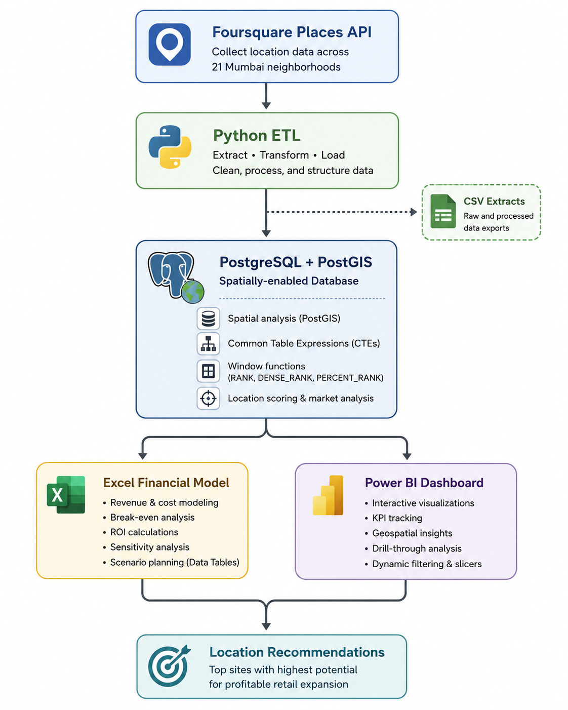

# Mumbai Retail Intelligence Engine: Data-Driven Store Location Analytics for Mumbai

[](https://www.python.org/)
[](https://www.postgresql.org/)
[](https://postgis.net/)
[](https://powerbi.microsoft.com/)

> This project is an end-to-end retail site-selection analytics solution that showcases Python ETL, Foursquare API integration, PostgreSQL with PostGIS, advanced SQL (Window Functions, CTEs), Excel financial modeling, and an interactive Power BI dashboard — analyzing 21 Mumbai locations to identify **high-potential retail sites**.

## Project Background

This project was built as a portfolio project to demonstrate end-to-end data analytics skills. It was inspired by real-world retail expansion challenges faced by chains entering new markets. The workflow is designed to be modular and adaptable to other cities or retail categories.

---

## Table of Contents

1. [Project Overview](#project-overview)
2. [Business Problem](#business-problem)
3. [Solution at a Glance](#solution-at-a-glance)
4. [Key Project Metrics](#key-project-metrics)
5. [Methodology](#methodology)
    - 5.1. [Data Collection — Python + Foursquare API](#1-data-collection--python--foursquare-api)
    - 5.2. [Database & Spatial Analysis — PostgreSQL + PostGIS](#2-database--spatial-analysis--postgresql--postgis)
    - 5.3. [Financial Modeling — Excel](#3-financial-modeling--excel)
    - 5.4. [Dashboard & Visualization — Power BI](#4-dashboard--visualization--power-bi)
6. [Technology Stack](#technology-stack)
7. [Repository Structure](#repository-structure)
8. [Locations Analyzed](#locations-analyzed)
9. [Scoring Model](#scoring-model)
10. [Key Findings](#key-findings)
11. [Dashboard Previews](#dashboard-previews)
12. [How to Run the Project](#how-to-run-the-project)
    - 12.1. [Prerequisites](#prerequisites)
    - 12.2. [Create the PostgreSQL Database](#1-create-the-postgresql-database)
    - 12.3. [Install Python Dependencies](#2-install-python-dependencies)
    - 12.4. [Configure Environment Variables](#3-configure-environment-variables)
    - 12.5. [Run the Data Pipeline](#4-run-the-data-pipeline)
    - 12.6. [Execute SQL Analysis](#5-execute-sql-analysis)
    - 12.7. [Explore the Excel Financial Model](#6-explore-the-excel-financial-model)
    - 12.8. [Open the Power BI Dashboard](#7-open-the-power-bi-dashboard)
13. [SQL Analysis Highlights](#sql-analysis-highlights)
14. [Excel Financial Model](#excel-financial-model)
15. [Power BI Dashboard](#power-bi-dashboard)
16. [Future Improvements](#future-improvements)
17. [Acknowledgments](#acknowledgments)
18. [Connect](#connect)

---

## Project Overview

The **Retail Intelligence Engine** is an end-to-end analytics project designed to answer a practical retail expansion question:

> **Where should a retail business open its next store in Mumbai to maximize its chances of success?**

The project combines external place data, relational and spatial database analysis, financial modeling, and interactive business intelligence into a single decision-support workflow.

### End-to-End Workflow
<p>

</p>

---

## What the project demonstrates

- **Data acquisition:** Collecting place intelligence from the Foursquare API.
- **ETL:** Cleaning, transforming, and loading location data with Python.
- **Data engineering:** Storing analytical data in PostgreSQL with PostGIS support.
- **Advanced SQL:** Applying CTEs, window functions, ranking, normalization, and spatial analysis.
- **Financial analysis:** Converting operational assumptions into revenue, profit, break-even, ROI, and scenario analyses.
- **Business intelligence:** Presenting results through an interactive Power BI report with drill-through and slicers.
- **Decision support:** Translating raw location data into a prioritized shortlist of recommended markets.

---

## Business Problem

Choosing a store location is a high-impact decision. A location can have strong demand signals but still perform poorly if competition is too high, commercial activity is weak, or the economics do not support the required return.

This project evaluates candidate neighborhoods across multiple dimensions:

| Decision Factor | What It Helps Answer |
|---|---|
| **Foot traffic potential** | Does the area have enough activity to support customer demand? |
| **Competitor density** | Is the target market underserved or already saturated? |
| **Commercial activity** | Are there nearby businesses and destinations that can contribute to demand? |
| **Location score** | How attractive is the area relative to other candidates? |
| **Financial viability** | Can the location generate a positive projected return under the model assumptions? |

The final objective is not simply to find the busiest area, but to identify locations where **market attractiveness and financial viability intersect**.

---

## Solution at a Glance

| Stage | Primary Tooling | Output |
|---|---|---|
| **Collect** | Python + Foursquare API | Raw place and location data |
| **Transform** | Python + pandas | Structured CSV datasets |
| **Store** | PostgreSQL + PostGIS | Queryable analytical database |
| **Analyze** | SQL | Scores, rankings, density, and market-gap analysis |
| **Model** | Excel | Revenue, cost, profit, ROI, and sensitivity scenarios |
| **Visualize** | Power BI + DAX | Interactive dashboards and recommendations |
| **Decide** | Combined analytics | Ranked store-location shortlist |

---

## Key Project Metrics

| Metric | Value |
|---|---:|
| **Mumbai locations analyzed** | 21 |
| **Place categories analyzed** | 18 |
| **Competitor cafes identified** | 679 |
| **Advanced SQL analyses** | 6 |
| **Power BI report pages** | 3 |
| **Top recommended locations** | 5 |

---

## Methodology

### 1. Data Collection — Python + Foursquare API

The data pipeline collects place intelligence across **21 Mumbai locations** and analyzes **18 place categories**, including restaurants, cafes, offices, shopping malls, parks, gyms, banks, hospitals, and tourist attractions.

The project identifies **679 competitor cafes**, retaining names, addresses, and geographic information for downstream analysis.

#### Locations analyzed

- Colaba
- Fort
- Churchgate
- Marine Lines
- Dadar
- Lower Parel
- Bandra West
- Bandra Kurla Complex
- Andheri East
- Andheri West
- Juhu
- Powai
- Ghatkopar
- Malad
- Kandivali
- Goregaon
- Navi Mumbai (Vashi)
- Sion
- Matunga
- Versova
- Vikhroli

The resulting datasets are written to `data/` and loaded into PostgreSQL for analysis.

---

### 2. Database & Spatial Analysis — PostgreSQL + PostGIS

The database layer is designed around a **star-schema-oriented analytical structure** and uses PostGIS for geospatial operations. PostGIS is a spatial extension for PostgreSQL that turns your regular database into a geographic information system (GIS).

### PostGIS Note

While PostGIS was installed and enabled as the spatial backend, the current analysis uses latitude/longitude as standard coordinates without leveraging advanced spatial functions. This was a deliberate scope decision to focus on category-based scoring. Future versions can incorporate spatial queries for distance-based competitor density, catchment area analysis, and cluster detection.

The SQL analysis layer contains **6 analytical queries**, including location scoring, rankings, competitor density, and market-gap analysis.

Key SQL techniques include:

- **Common Table Expressions (CTEs)** for modular, readable transformations
- **Window functions** such as `RANK()`, `DENSE_RANK()`, and `PERCENT_RANK()`
- **Normalization** for comparing metrics across locations
- **Spatial joins and geographic calculations** using PostGIS
- **Weighted scoring** to combine multiple market signals into a single decision metric

---

### 3. Financial Modeling — Excel

The financial model translates location-level demand and business assumptions into projected operating performance.

It includes:

- Revenue projections based on estimated foot traffic
- Monthly operating costs
- Profit calculations
- Break-even analysis
- ROI calculations
- Rent and foot-traffic sensitivity analysis
- What-if scenario planning through Excel Data Tables

#### Base assumptions

| Assumption | Value |
|---|---:|
| **Average spend per customer** | ₹450 |
| **Daily customers per 1,000 foot traffic** | 80 |
| **Monthly rent** | ₹90,000 |
| **Monthly staff cost** | ₹80,000 |
| **Monthly marketing budget** | ₹20,000 |

These assumptions feed the financial model and can be adjusted to test alternative scenarios.

---

### 4. Dashboard & Visualization — Power BI

The Power BI report contains **3 interactive pages** designed for progressively deeper analysis:

| Page | Purpose | Key Components |
|---|---|---|
| **Executive Summary** | High-level decision view | KPI cards, Top 10 ranking, detailed data table |
| **Market Intelligence** | Explore market structure | Geospatial map, traffic-vs-competition scatter plot, pie/donut charts, treemap |
| **Final Recommendations** | Focus on the shortlist | Top 5 locations, profitability view, gauge, recommendation metrics |

The report also uses:

- **DAX measures** for custom calculations
- **Slicers** for interactive filtering
- **Drill-through** for location-level detail
- Interactive geographic visualization for spatial context

---

## Technology Stack

| Layer | Technologies |
|---|---|
| **Data Extraction** | Python 3.8+, Foursquare Places API, Requests, pandas |
| **Data Storage** | PostgreSQL 16+, PostGIS 3.4+ |
| **Analytics** | SQL, CTEs, window functions, ranking, spatial analysis |
| **Financial Modeling** | Microsoft Excel, Power Query, Data Tables, Sensitivity Analysis |
| **Visualization** | Power BI Desktop, DAX, Maps, Drill-through |
| **Version Control** | Git, GitHub |
| **Configuration & Secrets** | `python-dotenv`, environment variables |

---


## Locations Analyzed

The project evaluates 21 Mumbai locations:

| # | Location | # | Location | # | Location |
|---:|---|---:|---|---:|---|
| 1 | Colaba | 8 | Bandra Kurla Complex | 15 | Kandivali |
| 2 | Fort | 9 | Andheri East | 16 | Goregaon |
| 3 | Churchgate | 10 | Andheri West | 17 | Navi Mumbai (Vashi) |
| 4 | Marine Lines | 11 | Juhu | 18 | Sion |
| 5 | Dadar | 12 | Powai | 19 | Matunga |
| 6 | Lower Parel | 13 | Ghatkopar | 20 | Versova |
| 7 | Bandra West | 14 | Malad | 21 | Vikhroli |

---

## Scoring Model

The project combines positive market signals with a competition penalty to produce a weighted location score. We use a weighted scoring formula to evaluate each location's commercial potential. The weights shown below are for **demonstration purposes** to illustrate the methodology. The weighting system can be fine-tuned by adjusting weights based on empirical demand data, customer surveys, or store performance history.

**Positive factors (foot traffic drivers):**

| Category | Weight | Rationale |
|----------|--------|-----------|
| Restaurant | 0.8 | Strongest foot traffic driver (lunch/dinner crowds) |
| Shopping Mall | 0.7 | Large concentrated shopper traffic |
| Office | 0.6 | Consistent weekday traffic from employees |
| Tourist Attraction | 0.6 | Strong weekend/visitor traffic |
| Park | 0.5 | Recreational traffic (weekends, after-work) |
| Gym | 0.4 | Niche but consistent traffic |
| Bank | 0.3 | Limited transactional traffic |
| Hospital | 0.3 | Focused visitor traffic |
| School | 0.3 | Focused traffic (parents, students) |

**Negative factors (competition penalties):**

| Category | Weight | Rationale |
|----------|--------|-----------|
| Cafe | -0.8 | Direct competitor penalty |
| Bar | -0.3 | Partial competitor penalty |

### Weighted scoring formula

```text
Weighted Score =
    (Restaurant × 0.8)
  + (Shopping Mall × 0.7)
  + (Office × 0.6)
  + (Park × 0.5)
  + (Gym × 0.4)
  + (Tourist Attraction × 0.6)
  + (Bank × 0.3)
  + (Hospital × 0.3)
  + (School × 0.3)
  - (Cafe × 0.8)
  - (Bar × 0.3)
```

The dataset contains 18 place categories overall; the formula above shows the categories explicitly used in the weighted scoring calculation documented in the project.

### Interpretation

- Higher positive weights indicate stronger contributions to the location score.
- `Cafe` receives a comparatively large negative weight because it is treated as a direct competitor signal.
- `Bar` also contributes a smaller competition penalty.
- The final score is used to rank candidate locations relative to one another.

---

## Key Findings

### Executive Findings

| Metric | Finding |
|---|---|
| **Best location** | Fort |
| **Highest score** | 185 — shared by Fort, Churchgate, Lower Parel, Bandra West, and Juhu |
| **Total locations analyzed** | 21 |
| **Total competitors identified** | 679 |
| **Profitable locations** | 5 — Fort, Churchgate, Lower Parel, Bandra West, and Juhu |
| **Projected monthly profit** | ₹50,000 per top location |
| **Market gap** | Versova shows high foot traffic with low competitor density |
| **ROI for top locations** | 3% |

### Top 5 Locations

| Rank | Location | Score | Foot Traffic | Cafe Count | Monthly Profit |
|---:|---|---:|---:|---:|---:|
| 1 | Fort | 185 | 250 | 50 | ₹50,000 |
| 2 | Churchgate | 185 | 250 | 50 | ₹50,000 |
| 3 | Lower Parel | 185 | 250 | 50 | ₹50,000 |
| 4 | Bandra West | 185 | 250 | 50 | ₹50,000 |
| 5 | Juhu | 185 | 250 | 50 | ₹50,000 |

### Business Insights

1. **South Mumbai performs strongly in the ranking.** Fort, Churchgate, and Lower Parel occupy the top tier of the final recommendations.
2. **Bandra Kurla Complex combines strong commercial activity with high competition.** This makes it attractive from a demand perspective but more challenging from a market-saturation perspective.
3. **Versova appears to be an underserved opportunity.** The market-gap analysis indicates high foot traffic alongside comparatively low competitor density.
4. **Vikhroli and Goregaon are weaker candidates under the current model.** Their lower foot-traffic and commercial-activity signals reduce their overall attractiveness.

---

## Dashboard Previews

The project includes three Power BI report pages. Preview images are stored in [`screenshots/`](screenshots/).

| Page | Description | Preview |
|---|---|---|
| **Executive Summary** | KPI cards, Top 10 locations by score, and the full location table | [Open Image](screenshots/page_1_summary_dashboard.png) |
| **Market Intelligence** | Geospatial map, traffic-vs-competition scatter plot, pie/donut charts, and treemap | [Open Image](screenshots/page_2_market_intelligence.png) |
| **Final Recommendations** | Top 5 locations, profit contribution, recommendation metrics, and gauge | [Open Image](screenshots/page_3_recommendations.png) |


---

## How to Run the Project

### Prerequisites

| Software | Required Version |
|---|---|
| **Python** | 3.8+ |
| **PostgreSQL** | 16+ |
| **PostGIS** | 3.4+ |
| **Power BI Desktop** | Latest available version recommended |
| **Microsoft Excel** | 2016+ |

You will also need a valid **Foursquare API key** and PostgreSQL credentials.

---

### 1. Create the PostgreSQL Database

Create the database and enable PostGIS:

```sql
CREATE DATABASE site_selection;

-- Connect to the newly created database, then run:
CREATE EXTENSION postgis;
```

> **Note:** `CREATE EXTENSION postgis;` must be executed while connected to the `site_selection` database.

---

### 2. Install Python Dependencies

From the project root:

```bash
cd src
pip install -r requirements.txt
```

The project dependencies are:

```text
requests
pandas
psycopg2-binary
sqlalchemy
python-dotenv
```

---

### 3. Configure Environment Variables

Create a `.env` file in the project root:

```dotenv
FOURSQUARE_API_KEY=your_foursquare_api_key_here
DB_PASSWORD=your_postgres_password_here
```

Keep secrets out of source control:

```gitignore
.env
```

> **Security:** Never commit API keys, database passwords, or other credentials to GitHub.

---

### 4. Run the Data Pipeline

From the project root:

```bash
python src/data_pipeline.py
```

The pipeline is responsible for:

1. Fetching location data from the Foursquare API.
2. Producing CSV outputs in `data/`.
3. Loading analytical data into PostgreSQL.

For troubleshooting the database connection, use:

```bash
python src/test_db.py
```

---

### 5. Execute SQL Analysis

Open:

```text
sql/analysis_queries.sql
```

Run the six analysis queries in pgAdmin or another PostgreSQL client.

The generated analytical outputs include:

- Weighted location scores
- Location rankings
- Market-gap analysis
- Competitor density
- Dashboard summary data

---

### 6. Explore the Excel Financial Model

Open:

```text
excel_model/mumbai_retail_model.xlsx
```

The workbook contains:

| Sheet | Purpose |
|---|---|
| **Assumptions** | Business inputs, including spend, traffic conversion, rent, staff costs, and marketing |
| **Model** | Revenue, cost, profit, ROI, and break-even calculations |
| **Sensitivity** | Scenario analysis across rent and foot-traffic assumptions |
| **Dashboard** | Summary metrics, top locations, charts, and recommendations |

---

### 7. Open the Power BI Dashboard

Open:

```text
power_bi/Mumbai_Retail_Intelligence.pbix
```

If Power BI prompts for a PostgreSQL connection, use the configured environment for the project. The original model documentation specifies:

```text
Server:   localhost:5433
Database: site_selection
```

Then:

1. Confirm the data source connection.
2. Refresh the data.
3. Navigate through the three report pages:
   - **Executive Summary**
   - **Market Intelligence**
   - **Final Recommendations**

> **Tip:** If your PostgreSQL instance is running on the default port rather than `5433`, update the Power BI data source accordingly.

---

## SQL Analysis Highlights

The project contains six SQL analyses. Three representative analyses are highlighted below.

### Query 2 — Weighted Location Scores

Calculates a weighted score for each location using the project's scoring model and returns the competitor count alongside the score.

```sql
WITH location_scores AS (
    SELECT
        location_name,
        (
            restaurant * 0.8
          + shopping_mall * 0.7
          + office * 0.6
          + park * 0.5
          + gym * 0.4
          + tourist_attraction * 0.6
          + bank * 0.3
          + hospital * 0.3
          + school * 0.3
        )
        - (cafe * 0.8 + bar * 0.3) AS weighted_score,
        cafe AS competitor_count
    FROM mumbai_location_analysis
)
SELECT
    location_name,
    ROUND(weighted_score::numeric, 2) AS location_score,
    competitor_count
FROM location_scores
ORDER BY weighted_score DESC;
```

### Query 3 — Location Rankings with Window Functions

Uses ranking functions to compare locations and calculate each location's percentile position.

```sql
WITH location_scores AS (
    -- scoring logic
)
SELECT
    location_name,
    ROUND(weighted_score::numeric, 2) AS score,
    RANK() OVER (ORDER BY weighted_score DESC) AS location_rank,
    ROUND(
        PERCENT_RANK() OVER (ORDER BY weighted_score DESC) * 100,
        1
    ) AS percentile
FROM location_scores
ORDER BY location_rank;
```

The project also uses `DENSE_RANK()` where appropriate to handle tied scores without creating gaps in the rank sequence.

### Query 4 — Market Gap Analysis

Identifies locations with stronger traffic signals and comparatively lower competition.

The normalized metrics are calculated in a separate CTE so the query remains valid in PostgreSQL and avoids referencing a column alias within the same `SELECT` list.

```sql
WITH metrics AS (
    SELECT
        location_name,
        cafe AS competitors,
        restaurant
            + shopping_mall
            + office
            + park
            + tourist_attraction AS foot_traffic
    FROM mumbai_location_analysis
),
normalized AS (
    SELECT
        location_name,
        foot_traffic,
        competitors,
        foot_traffic::numeric / MAX(foot_traffic) OVER () AS traffic_norm,
        competitors::numeric / MAX(competitors) OVER () AS comp_norm
    FROM metrics
)
SELECT
    location_name,
    foot_traffic,
    competitors,
    ROUND(
        (traffic_norm * 0.7 - comp_norm * 0.3) * 100,
        1
    ) AS opportunity_score
FROM normalized
ORDER BY opportunity_score DESC;
```

---

## Excel Financial Model

The Excel workbook acts as the financial decision layer of the project.

### Assumptions

Centralizes the model inputs so business users can change operating assumptions without rebuilding the model.

### Model

Calculates:

- Estimated revenue
- Operating costs
- Monthly profit
- ROI
- Break-even metrics

Conditional formatting is used to highlight profitability across locations.

### Sensitivity

Uses Excel What-If/Data Table functionality to assess how projected profit changes under alternative rent and foot-traffic assumptions.

### Dashboard

Provides a compact management view containing:

- Top locations
- Key financial metrics
- Charts and visual summaries
- Recommendation-oriented outputs

---

## Power BI Dashboard

The Power BI report is structured to move from **overview → exploration → decision**.

### Page 1 — Executive Summary

Designed for an executive or hiring-manager-style first read.

**Primary elements:**

- KPI cards
- Top 10 location ranking
- Full location comparison table

### Page 2 — Market Intelligence

Designed for market exploration and competitive context.

**Primary elements:**

- Geospatial map
- Traffic vs. competition scatter plot
- Pie chart
- Donut chart
- Treemap

### Page 3 — Final Recommendations

Designed to answer the ultimate business question: **which locations should be prioritized?**

**Primary elements:**

- Top 5 locations
- Profit contribution
- Recommendation metrics
- Gauge visualization
- Location-level drill-through

---

## Future Improvements

| Improvement | Description |
|---|---|
| **Demographic Integration** | Add population density, income levels, and age distribution to improve demand modeling. |
| **Real-Time Data Refresh** | Automate data collection and refresh through a scheduled pipeline. |
| **Multi-City Expansion** | Extend the framework to Delhi, Bengaluru, Hyderabad, and other markets. |
| **Consumer Sentiment** | Incorporate social-media and review data to estimate location reputation and customer sentiment. |
| **Web Application** | Build a self-service application for non-technical users. |
| **Machine Learning** | Explore predictive models for store performance and demand forecasting. |

---


## Acknowledgments

**Foursquare Places API** — Provided the location intelligence data that powered the entire analysis, enabling collection of place counts and competitor information across 21 Mumbai neighborhoods.

**PostgreSQL with PostGIS** — Served as the analytical database, with PostGIS providing spatial capabilities for storing and querying geographic location data.

**Microsoft Power BI** — Enabled the creation of interactive dashboards with geospatial mapping, dynamic filtering, and drill-through capabilities for location-level analysis.

**Microsoft Excel** — Powered the financial modeling layer, including revenue projections, sensitivity analysis, and break-even calculations using Power Query and Data Tables.

**Open-Source Community** — The Python ecosystem and PostgreSQL documentation provided invaluable guidance throughout the development process.

